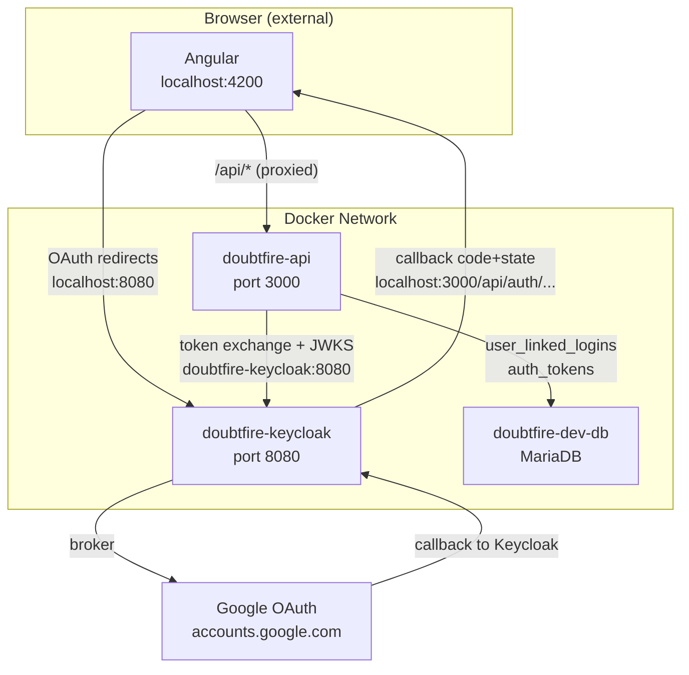
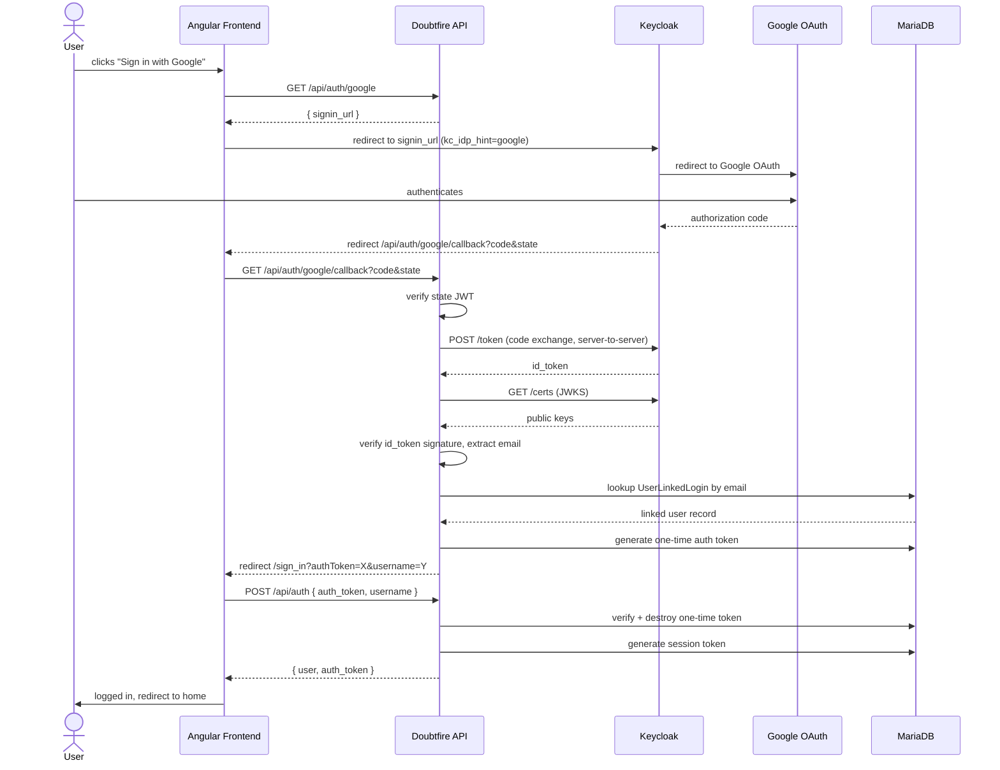
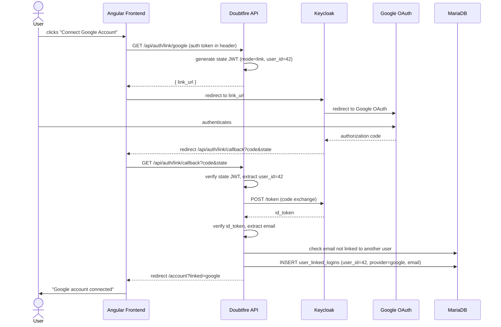

```mermaid
graph TB
    subgraph Browser["Browser (external)"]
        FE["Angular\nlocalhost:4200"]
    end

    subgraph Docker["Docker Network"]
        API["doubtfire-api\nport 3000"]
        KC["doubtfire-keycloak\nport 8080"]
        DB["doubtfire-dev-db\nMariaDB"]
    end

    GOOGLE["Google OAuth\naccounts.google.com"]

    FE -- "/api/* (proxied)" --> API
    FE -- "OAuth redirects\nlocalhost:8080" --> KC
    KC -- "broker" --> GOOGLE
    GOOGLE -- "callback to Keycloak" --> KC
    KC -- "callback code+state\nlocalhost:3000/api/auth/..." --> FE
    API -- "token exchange + JWKS\ndoubtfire-keycloak:8080" --> KC
    API -- "user_linked_logins\nauth_tokens" --> DB
```

Sign-in flow starter:

```mermaid
sequenceDiagram
    actor User
    participant FE as Angular Frontend
    participant API as Doubtfire API
    participant KC as Keycloak
    participant G as Google OAuth
    participant DB as MariaDB

    User->>FE: clicks "Sign in with Google"
    FE->>API: GET /api/auth/google
    API-->>FE: { signin_url }
    FE->>KC: redirect to signin_url (kc_idp_hint=google)
    KC->>G: redirect to Google OAuth
    User->>G: authenticates
    G-->>KC: authorization code
    KC-->>FE: redirect /api/auth/google/callback?code&state
    FE->>API: GET /api/auth/google/callback?code&state
    API->>API: verify state JWT
    API->>KC: POST /token (code exchange, server-to-server)
    KC-->>API: id_token
    API->>KC: GET /certs (JWKS)
    KC-->>API: public keys
    API->>API: verify id_token signature, extract email
    API->>DB: lookup UserLinkedLogin by email
    DB-->>API: linked user record
    API->>DB: generate one-time auth token
    API-->>FE: redirect /sign_in?authToken=X&username=Y
    FE->>API: POST /api/auth { auth_token, username }
    API->>DB: verify + destroy one-time token
    API->>DB: generate session token
    API-->>FE: { user, auth_token }
    FE->>User: logged in, redirect to home
```
Account linking flow starter:

```mermaid
sequenceDiagram
    actor User
    participant FE as Angular Frontend
    participant API as Doubtfire API
    participant KC as Keycloak
    participant G as Google OAuth
    participant DB as MariaDB

    User->>FE: clicks "Connect Google Account"
    FE->>API: GET /api/auth/link/google (auth token in header)
    API->>API: generate state JWT (mode=link, user_id=42)
    API-->>FE: { link_url }
    FE->>KC: redirect to link_url
    KC->>G: redirect to Google OAuth
    User->>G: authenticates
    G-->>KC: authorization code
    KC-->>FE: redirect /api/auth/link/callback?code&state
    FE->>API: GET /api/auth/link/callback?code&state
    API->>API: verify state JWT, extract user_id=42
    API->>KC: POST /token (code exchange)
    KC-->>API: id_token
    API->>API: verify id_token, extract email
    API->>DB: check email not linked to another user
    API->>DB: INSERT user_linked_logins (user_id=42, provider=google, email)
    API-->>FE: redirect /account?linked=google
    FE->>User: "Google account connected"
```